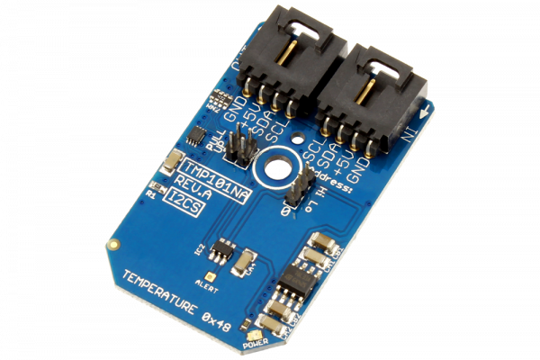

# TMP101

The TMP101 device is digital temperature sensor ideal for NTC and PTC thermistor replacement. The on-chip 12-bit ADC offers resolutions down to 0.0625°C. TheTMP101 allows up to eight devices on one I2C bus. 
This Device is available from www.ncd.io 

[SKU: TMP101]

(https://store.ncd.io/product/tmp101-digital-temperature-sensor-with-alert-function-i2c-mini-module/)
This Sample code can be used with Arduino.

Hardware needed to interface TMP101 sensor with Arduino

1. <a href="https://store.ncd.io/product/i2c-shield-for-arduino-nano/">Arduino Nano</a>

2. <a href="https://store.ncd.io/product/i2c-shield-for-arduino-micro-with-i2c-expansion-port/">Arduino Micro</a>

3. <a href="https://store.ncd.io/product/i2c-shield-for-arduino-uno/">Arduino uno</a>

4. <a href="https://store.ncd.io/product/dual-i2c-shield-for-arduino-due-with-modular-communications-interface/">Arduino Due</a>

5. <a href="https://store.ncd.io/product/tmp101-digital-temperature-sensor-with-alert-function-i2c-mini-module/">TMP101 Temperature Sensor</a>

6. <a href="https://store.ncd.io/product/i%C2%B2c-cable/">I2C Cable</a>

TMP101:

The TMP101 device is digital temperature sensor ideal for NTC and PTC thermistor replacement. The on-chip 12-bit ADC offers resolutions down to 0.0625°C. TheTMP101 allows up to eight devices on one I2C bus. 

Applications:

• Battery management

• Computer peripheral thermal protection

• Electromechanical device temperature monitoring etc.

How to Use the TMP101 Arduino Library

The TMP101 has a number of settings, which can be configured based on user requirements.
          
1.One shot mode:The following command is used to DISABLE the one shot mode..

             tmp.setOneShot(ONESHOT_DISABLED);        // Disabled
            
2.Shut down mode:The following command is used to DISABLE the shut down mode.

            tmp.setShutdown(SHUTDOWN_DISABLE);      // Disable
            
3.Resolution setting:The following command is used to set the resolution.

             tmp.setResolution(RESOLUTION_12);       // 12 bit, data shifted right by 4 bits, multiply by 0.0625, (___>> 4) * 0.0625
           
